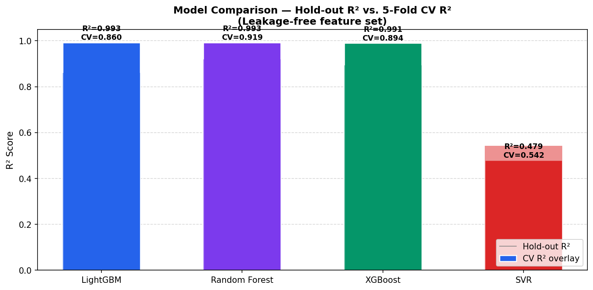

# 📈 Digital Marketing Campaign Analysis & Revenue Intelligence

<div align="center">


<p align="center">
  <b>An end-to-end Marketing Operations, Financial Unit Economics, and Machine Learning Revenue Forecasting Suite.</b>
</p>

</div>

---

## 📌 Overview

**Digital Marketing Campaign Analysis & Revenue Intelligence** is a portfolio-ready analytics solution designed to evaluate multi-channel digital advertising campaigns, quantify unit economics, and forecast campaign revenue using trained machine learning regression pipelines.

The system combines:
1. **Exploratory Data Analysis (EDA)** across 15,408 campaign observations.
2. **Leakage-Free Machine Learning Regression Pipelines** benchmarking LightGBM, Random Forest, XGBoost, and Support Vector Regression (SVR).
3. **An Interactive Streamlit Business Intelligence Dashboard** featuring multi-dimensional filtering, unit economics ledgers, automated rule-based diagnostics, and a What-If budget scenario simulator.

<div align="center">
  
</div>

---

## 🎯 Problem Statement

Performance marketing teams often struggle to answer three critical operational questions:
1. **Attribution & Efficiency**: Which publisher placements, creative dimensions, and audience engagement tiers deliver the highest Return on Ad Spend (ROAS)?
2. **Unit Economics Clarity**: How do operational ad metrics (CTR, CPC, CVR, CPA) translate into net operating profit and margin?
3. **Forecasting & Budget Planning**: What is the projected revenue outcome of changing a campaign's budget, target audience, placement, or creative format before committing ad spend?

---

## 🏆 Objectives

- **Multi-Channel Performance Auditing**: Evaluate historical performance across campaigns (`camp 1`, `camp 2`, `camp 3`), creative dimensions (banners), and publisher placements.
- **Accurate Financial Modeling**: Implement consistent financial formulas that separate gross return (ROAS) from net return percentage (ROI) and net operating margin.
- **Target Leakage Prevention**: Enforce strict separation between post-outcome business metrics and valid prediction-time features.
- **Predictive Decision Support**: Train, evaluate, and serialize an ML regression model to simulate revenue outcomes across what-if budget scenarios.
- **Actionable Strategic Diagnostics**: Provide evidence-based, data-grounded observations and a rule-based query assistant.

---

## 💡 Solution Architecture

```text
┌────────────────────────────────────────────────────────────────────────┐
│             DIGITAL MARKETING DATA PIPELINE & ARCHITECTURE              │
└────────────────────────────────────────────────────────────────────────┘

 1. INGESTION & AUDIT       2. MODEL TRAINING & VALIDATION    3. STREAMLIT BI APP
 ┌──────────────────────┐   ┌─────────────────────────────┐   ┌──────────────────────┐
 │ online_advertising_  │   │  model_training.py          │   │  app.py              │
 │ performance_data.csv │──▶│  - Leakage audit            │──▶│  - Executive KPIs    │
 │ (15,408 records)     │   │  - 5-Fold Cross Validation  │   │  - 5 Analytics Tabs  │
 └──────────────────────┘   │  - LightGBM / RF / XGB / SVR│   │  - What-If Simulator │
                            └──────────────┬──────────────┘   │  - Rule-Based Q&A    │
                                           │                  └──────────────────────┘
                                           ▼
                                ┌──────────────────────┐
                                │ best_advertising_    │
                                │ model.pkl (Pipeline) │
                                └──────────────────────┘
```

---

## 📊 Business Metrics & Definitions

To maintain technical and financial rigor, all metrics are formally defined and computed from aggregated numerators and denominators across filtered segments:

| Metric | Type | Definition & Mathematical Formula | Purpose |
| :--- | :--- | :--- | :--- |
| **ROAS** | Multiplier | $$\text{ROAS} = \frac{\sum \text{Revenue}}{\sum \text{Cost}}$$ | Measures gross revenue generated per dollar of ad spend (e.g., $2.50\times$). |
| **ROI** | Percentage | $$\text{ROI} = \left(\frac{\sum \text{Revenue} - \sum \text{Cost}}{\sum \text{Cost}}\right) \times 100\%$$ | Measures net financial return on capital invested after deducting media cost. |
| **Net Profit** | Currency ($) | $$\text{Net Profit} = \sum \text{Revenue} - \sum \text{Cost}$$ | Absolute net operating profit generated from advertising. |
| **Profit Margin** | Percentage | $$\text{Margin} = \left(\frac{\text{Net Profit}}{\sum \text{Revenue}}\right) \times 100\%$$ | Share of gross revenue retained as profit. |
| **CTR** | Percentage | $$\text{CTR} = \left(\frac{\sum \text{Clicks}}{\sum \text{Displays}}\right) \times 100\%$$ | Click-Through Rate measuring creative engagement efficiency. |
| **CPC** | Currency ($) | $$\text{CPC} = \frac{\sum \text{Cost}}{\sum \text{Clicks}}$$ | Cost Per Click measuring traffic acquisition cost. |
| **CPM** | Currency ($) | $$\text{CPM} = \left(\frac{\sum \text{Cost}}{\sum \text{Displays}}\right) \times 1000$$ | Cost Per Mille (cost per 1,000 ad impressions). |
| **CVR** | Percentage | $$\text{CVR} = \left(\frac{\sum \text{Conversions}}{\sum \text{Clicks}}\right) \times 100\%$$ | Conversion Rate measuring click-to-lead/sale conversion. |
| **CPA** | Currency ($) | $$\text{CPA} = \frac{\sum \text{Cost}}{\sum \text{Conversions}}$$ | Cost Per Acquisition measuring ad spend required per converted customer. |

> **Important Terminology Distinction**: ROAS and ROI are not interchangeable. A ROAS of $2.0\times$ represents a break-even $+100\%$ ROI. A ROAS of $1.0\times$ represents a $0\%$ ROI (break-even).

---

## 📁 Dataset & Schema

The dataset `online_advertising_performance_data.csv` contains **15,408 records** collected across daily advertising operations from April through June:

- `month` *(String)*: Deployment month (`April`, `May`, `June`).
- `day` *(Integer)*: Day of the month (1–31).
- `campaign_number` *(Categorical)*: Campaign identifier (`camp 1`, `camp 2`, `camp 3`).
- `user_engagement` *(Categorical)*: Audience engagement tier (`High`, `Medium`, `Low`).
- `banner` *(Categorical)*: Creative format dimension (e.g., `300x250`, `728x90`, `160x600`, etc.).
- `placement` *(Categorical)*: Publisher inventory slot identifier.
- `displays` *(Integer)*: Number of ad impressions delivered.
- `cost` *(Float)*: Media budget spent ($).
- `clicks` *(Integer)*: Number of user clicks generated.
- `revenue` *(Float)*: Realized revenue ($) — **ML Target Variable**.
- `post_click_conversions` *(Integer)*: Number of post-click sales/conversions.
- `post_click_sales_amount` *(Float)*: Post-campaign sales revenue proxy — **Excluded from ML (Leakage)**.

---

## 🛡️ Machine Learning Approach & Leakage Prevention

### Target Leakage Audit
Predicting campaign revenue requires that all input features be available **before** or **during** campaign execution:
- **Excluded Features**:
  - `roi` & `roas`: Derived directly from the target revenue.
  - `net_profit` & `profit_margin`: Derived directly from the target revenue.
  - `post_click_sales_amount`: Recorded alongside realized revenue as a direct sales proxy.
- **Retained Features (12 Valid Inputs)**:
  - Configuration: `month`, `day`, `campaign_number`, `user_engagement`, `banner`, `placement`
  - Planned Operating Inputs: `displays`, `cost`, `clicks`, `post_click_conversions`
  - Forecast-Derived Features: `ctr` ($=\frac{\text{clicks}}{\text{displays}}$), `cpc` ($=\frac{\text{cost}}{\text{clicks}}$)

### Preprocessing & Validation
- **Categorical Preprocessing**: `OneHotEncoder(handle_unknown='ignore', sparse_output=False)`
- **Numerical Preprocessing**: `StandardScaler()`
- **Cross-Validation**: 80/20 Train-Test split (`random_state=42`) + 5-Fold Stratified Cross-Validation on the full feature space.

---

## 🔬 Model Comparison & Benchmark

The four candidate regression architectures were benchmarked under identical leakage-free training conditions:

| Model Architecture | Hold-out MAE ($) | Hold-out RMSE ($) | Hold-out $R^2$ | 5-Fold CV $R^2$ | Status |
| :--- | :---: | :---: | :---: | :---: | :---: |
| **LightGBM Regressor** | **$1.0071** | **$7.5698** | **0.9930** | **0.8595 ± 0.19** | 🥇 **Selected Pipeline** |
| **Random Forest Regressor** | $0.9022 | $7.7930 | 0.9926 | 0.9189 ± 0.09 | Evaluated Benchmark |
| **XGBoost Regressor** | $1.0740 | $8.7009 | 0.9908 | 0.8938 ± 0.09 | Evaluated Benchmark |
| **Support Vector Regressor (SVR)** | $5.3073 | $65.3236 | 0.4795 | 0.5424 ± 0.22 | Baseline Regressor |

<div align="center">
  
</div>

### Diagnostic Plots:
- **Predicted vs. Actual**: `outputs/predicted_vs_actual.png`
- **Residual Distribution**: `outputs/residual_plot.png`
- **SHAP Feature Importance**: `outputs/shap_feature_importance.png` (displays statistical feature contributions, not causal attribution)

---

## 🚀 Dashboard Modules

The Streamlit dashboard (`app.py`) is structured into 5 business-oriented modules:

1. **Executive Overview & Performance**:
   - Dual-axis daily time-series tracking gross revenue, media spend, and net profit.
   - 3-stage marketing conversion funnel (Displays $\rightarrow$ Clicks $\rightarrow$ Conversions).
   - Day-of-week revenue and ROAS efficiency analysis.
   - Cross-campaign side-by-side performance benchmarking.

2. **Placement & Creative Intelligence**:
   - Multi-dimensional placement matrix (Spend vs. Revenue vs. ROAS with a 1.0x break-even line).
   - Creative banner dimension revenue distribution (donut chart).
   - Audience engagement tier conversion rate (CVR) and CPA breakdown.
   - Top 10 revenue-generating publisher inventory slots table.

3. **Financial Ledger & Unit Economics**:
   - Audited unit economics ledger across campaigns and engagement tiers.
   - Strict ratio calculations from aggregated totals.
   - Conditional background gradients and one-click CSV ledger export.

4. **Machine Learning Forecast & What-If Simulator**:
   - Side-by-side **Baseline vs. Scenario** comparative ledger.
   - Calculates predicted revenue, net profit, ROAS, $\Delta$ revenue, $\Delta$ profit, and % changes.
   - Interactive budget scaling sensitivity curve ($0.5\times$ to $2.0\times$ multiplier).
   - Explicit fallback indicators and methodology caveats.

5. **Strategic Diagnostics & Query Assistant**:
   - Automated dynamic diagnostic cards highlighting top drivers, budget reallocation opportunities, and underperforming segments.
   - **Rule-Based Campaign Query Assistant** providing instant, data-backed answers to natural language metric questions.

---

## 📂 Project Structure

```text
digital-marketing-campaign-analysis/
│
├── app.py                                  # Production Streamlit BI Application
├── model_training.py                       # ML Training, Evaluation, SHAP & Serialization Pipeline
├── best_advertising_model.pkl              # Serialized Production Pipeline (LightGBM)
├── online_advertising_performance_data.csv # 15,408 Row Ad Operations Dataset
├── requirements.txt                        # Application Dependencies
├── README.md                               # Technical Documentation & Portfolio Guide
├── .gitignore                              # Git Exclusion Rules
│
├── .streamlit/
│   └── config.toml                         # Streamlit Theme & Server Settings
│
├── notebooks/
│   └── digital_marketing_analysis.ipynb    # Jupyter EDA & ML Development Notebook
│
├── screenshots/
│   └── dashboard.png                       # High-Resolution Dashboard UI Screenshot
│
└── outputs/
    ├── model_comparison.csv                # Benchmark Metrics CSV
    ├── model_comparison.png                # Model Hold-Out vs CV Comparison Plot
    ├── model_benchmark_comparison.png      # Alternative Benchmark Chart Artifact
    ├── predicted_vs_actual.png             # Regression Diagnostic: Predicted vs Actual
    ├── residual_plot.png                   # Regression Diagnostic: Residuals
    ├── shap_feature_importance.png         # SHAP Feature Importance Plot
    ├── feature_distributions.png           # Feature Distribution Histograms
    ├── correlation_heatmap.png             # Pearson Correlation Matrix
    ├── campaign_performance_benchmark.png  # Campaign Revenue Benchmark Bar Chart
    └── creative_dimension_analysis.png     # Creative Banner Revenue Bar Chart
```

---

## 🛠️ Installation & Setup

### Prerequisites
- Python 3.10+ (Recommended: Python 3.11 or 3.12)
- pip package manager

### 1. Clone or Navigate to Project
```bash
cd "c:\Users\vk\OneDrive\Desktop\DIGITAL MARKETING CAMPAIGN ANALYSIS"
```

### 2. Install Dependencies
```bash
pip install -r requirements.txt
```

### 3. (Optional) Retrain Machine Learning Models
```bash
python model_training.py
```

### 4. Run the Streamlit Dashboard
```bash
streamlit run app.py
```

👉 The dashboard will open in your browser at **`http://localhost:8501`**.

---

## ⚠️ Limitations

1. **Observational Data**: Historical records reflect observed campaign settings; predictions represent statistical associations rather than guaranteed causal effects.
2. **Static Inventory Pricing**: The simulation model assumes historical cost-per-click (CPC) and display pricing remain stable under scaled budgets.
3. **Timeframe Scope**: Dataset spans three operating months (April–June); seasonal effects outside this quarter are not captured.

---

## 🔮 Future Improvements

- [ ] Incorporate time-series forecasting models (Prophet, ARIMA) for multi-week seasonal trend forecasting.
- [ ] Implement multi-touch attribution (MTA) models (Markov chain, Shapley attribution) across touchpoints.
- [ ] Connect live advertising APIs (Google Ads, Meta Marketing API) for continuous automated data ingestion.

---

## 👩‍💻 Author

- **Lead Analyst & Developer**: **Samaa Shaikh**
- **Domain**: Digital Marketing Campaign Analytics, Performance BI & Predictive Modeling
