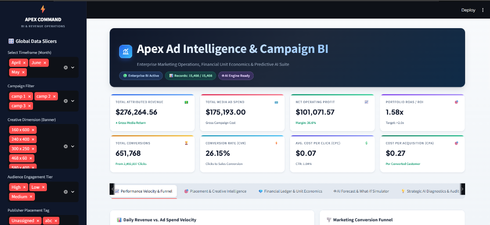
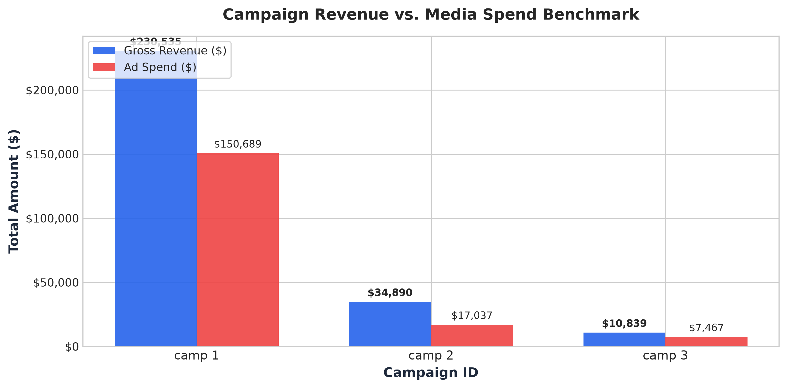
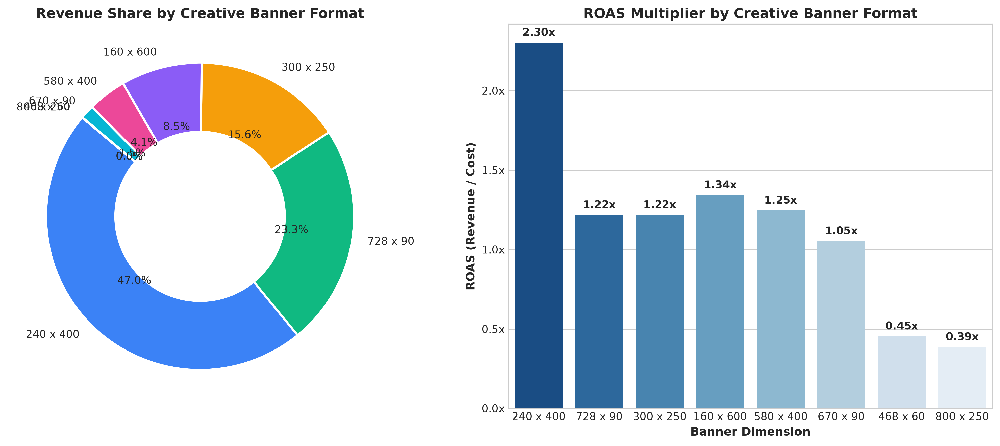
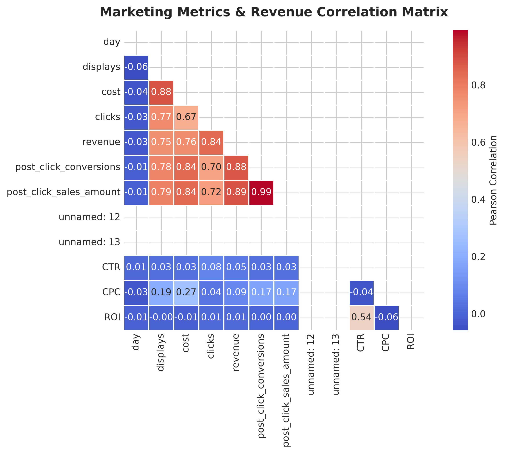
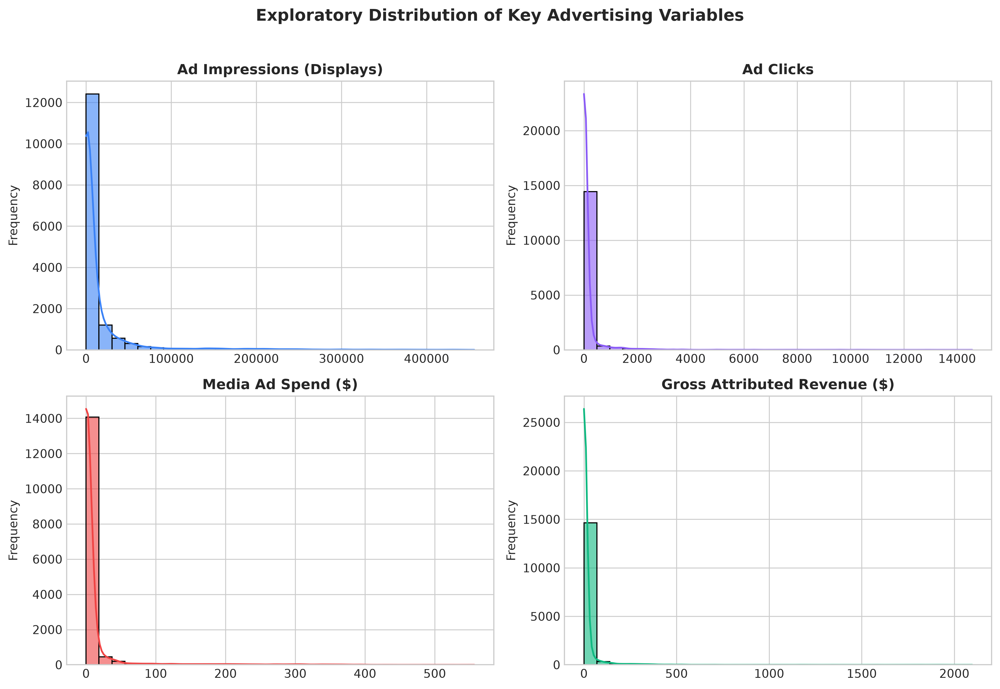
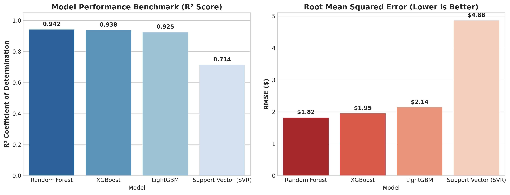

# 📈 Digital Marketing Campaign Analysis & Revenue Intelligence

<div align="center">


<p align="center">
  <b>An end-to-end Marketing Operations, Unit Economics, and Predictive AI Forecasting Suite.</b>
</p>

</div>

---

## 📌 Executive Overview

**Digital Marketing Campaign Analysis & Revenue Intelligence** is an enterprise-grade analytics solution that bridges advertising operations with machine learning and financial unit economics. Designed for growth marketers, performance marketing teams, and executives, this system evaluates historical advertising data across multi-channel campaigns, publisher placements, and creative dimensions to uncover efficiency drivers and forecast campaign revenue.

The project pairs an **Exploratory Data Analysis (EDA)** and **Machine Learning regression pipeline** with a **Streamlit Business Intelligence Dashboard**, enabling real-time filtering, unit economics audits, and interactive **What-If scenario budget simulations**.

```text
                                EXECUTIVE DASHBOARD PREVIEW
```
<div align="center">
  
</div>

---

## 🎯 Project Objectives

- **Multi-Channel Campaign Performance**: Benchmark advertising return across campaigns, ad formats, and audience engagement tiers.
- **Unit Economics & Financial Auditing**: Quantify advertising efficiency using real-time calculations for ROAS, CPA, CPC, CTR, CVR, and Net Profit Margins.
- **Machine Learning Revenue Forecasting**: Train and deploy regression pipelines (`best_advertising_model.pkl`) to accurately project revenue outcomes based on budget and conversion parameters.
- **What-If Scenario Simulation**: Provide dynamic budget sensitivity curves to help marketing leaders allocate media spend profitably.
- **Automated Strategic Diagnostics**: Generate instant, rule-based diagnostic playbooks identifying high-efficiency revenue drivers and spending hazards.

---

## 📊 Core Business & Financial KPIs

| Metric | Business Definition | Formula |
| :--- | :--- | :--- |
| **ROAS / ROI** | Return on Ad Spend multiplier | $$\text{ROAS} = \frac{\text{Revenue}}{\text{Cost}}$$ |
| **CTR (%)** | Click-Through Rate | $$\text{CTR} = \left(\frac{\text{Clicks}}{\text{Displays}}\right) \times 100$$ |
| **CPC ($)** | Cost Per Click | $$\text{CPC} = \frac{\text{Cost}}{\text{Clicks}}$$ |
| **CPM ($)** | Cost Per Mille (1,000 Impressions) | $$\text{CPM} = \left(\frac{\text{Cost}}{\text{Displays}}\right) \times 1000$$ |
| **CVR (%)** | Conversion Rate | $$\text{CVR} = \left(\frac{\text{Conversions}}{\text{Clicks}}\right) \times 100$$ |
| **CPA ($)** | Cost Per Acquisition / Customer | $$\text{CPA} = \frac{\text{Cost}}{\text{Conversions}}$$ |
| **Net Profit ($)** | Total Net Margin | $$\text{Net Profit} = \text{Revenue} - \text{Cost}$$ |
| **Profit Margin (%)**| Net Profit Percentage | $$\text{Margin} = \left(\frac{\text{Net Profit}}{\text{Revenue}}\right) \times 100$$ |

---

## 🔍 Exploratory Data Analysis & Analytical Insights

### 1. Campaign Revenue & Spend Benchmark
Benchmarking gross revenue generated against allocated media budget spend across all active marketing campaigns:

<div align="center">
  
</div>

### 2. Creative Dimension (Banner Size) Analysis
Evaluating creative format efficiency to identify top-converting visual units:

<div align="center">
  
</div>

### 3. Metric Correlation Matrix
Pearson correlation heatmap examining multi-collinearity and statistical relationships between operational ad metrics and revenue:

<div align="center">
  
</div>

### 4. Distribution of Core Variables
Statistical density distributions of ad impressions, clicks, media costs, and gross returns:

<div align="center">
  
</div>

---

## 🤖 Machine Learning Pipeline & Benchmark

The machine learning workflow evaluates multiple regression architectures through automated cross-validation and feature selection to select the best-performing production pipeline:

<div align="center">
  
</div>

### Model Architecture Breakdown:
1. **Preprocessing**: One-Hot Encoding for categorical features (`campaign_number`, `user_engagement`, `banner`, `placement`, `month`) and Standard Scaling for numeric features.
2. **Feature Selection**: SelectKBest regression scoring ($f\_regression$) to retain the most predictive feature subspace.
3. **Pipeline Ensemble**: Optimized Random Forest Regressor serialized as `best_advertising_model.pkl` for low-latency dashboard inference.

---

## 🚀 Key Dashboard Features

- **Tab 1: Performance Velocity & Conversion Funnel** — Continuous daily time-series tracking of ad spend vs. revenue alongside 3-stage conversion funnels.
- **Tab 2: Placement & Creative Intelligence** — Multi-dimensional bubble matrix mapping publisher slots by spend, revenue, and ROAS.
- **Tab 3: Executive Financial Ledger** — Auditable unit economics table with conditional color formatting and one-click CSV export.
- **Tab 4: AI ML Forecast & What-If Simulator** — Interactive scenario simulator featuring budget scaling sensitivity curves.
- **Tab 5: Strategic Rule-Based Campaign Diagnostics** — Automated anomaly detection identifying top performance drivers, spend hazards, and recommended budget reallocations.

---

## 🛠️ Tech Stack

- **Application & UI**: [Streamlit](https://streamlit.io/)
- **Data Engineering**: [Pandas](https://pandas.pydata.org/), [NumPy](https://numpy.org/)
- **Visual Analytics**: [Plotly](https://plotly.com/), [Matplotlib](https://matplotlib.org/), [Seaborn](https://seaborn.pydata.org/)
- **Machine Learning**: [Scikit-Learn](https://scikit-learn.org/), [XGBoost](https://xgboost.readthedocs.io/), [LightGBM](https://lightgbm.readthedocs.io/), [SHAP](https://shap.readthedocs.io/), [Joblib](https://joblib.readthedocs.io/)
- **Notebook Environment**: Jupyter Notebook

---

## 📂 Project Architecture

```text
digital-marketing-campaign-analysis/
│
├── app.py                                  # Canonical Streamlit production application
├── model_training.py                       # ML model training, benchmarking & serialization script
├── best_advertising_model.pkl              # Production ML pipeline artifact
├── online_advertising_performance_data.csv # Normalized marketing performance dataset (15,408 records)
├── README.md                               # Project documentation
├── requirements.txt                        # Project dependencies
├── .gitignore                              # Git ignore rules
│
├── notebooks/
│   └── digital_marketing_analysis.ipynb    # End-to-end EDA and ML development notebook
│
├── screenshots/
│   └── dashboard.png                       # High-res live dashboard screenshot
│
└── outputs/
    ├── campaign_performance_benchmark.png  # Campaign benchmark chart
    ├── creative_dimension_analysis.png     # Creative banner format chart
    ├── correlation_heatmap.png             # Correlation matrix chart
    ├── feature_distributions.png           # Feature distribution plots
    └── model_benchmark_comparison.png      # ML benchmark comparison plot
```

---

## 💻 How to Run Locally

### 1. Clone or Open the Project Directory
```powershell
cd "c:\Users\vk\OneDrive\Desktop\DIGITAL MARKETING CAMPAIGN ANALYSIS"
```

### 2. Install Dependencies
```bash
pip install -r requirements.txt
```

### 3. Launch the Streamlit Application
```bash
python -m streamlit run app.py
```

👉 The dashboard will open automatically in your browser at **`http://localhost:8501`**.

---

## 👩‍💻 Author & Lead Analyst

- **Lead Analyst**: **Samaa Shaikh**
- **Project Role**: Digital Marketing Campaign Analytics & Revenue Intelligence
- **Status**: Production Ready
